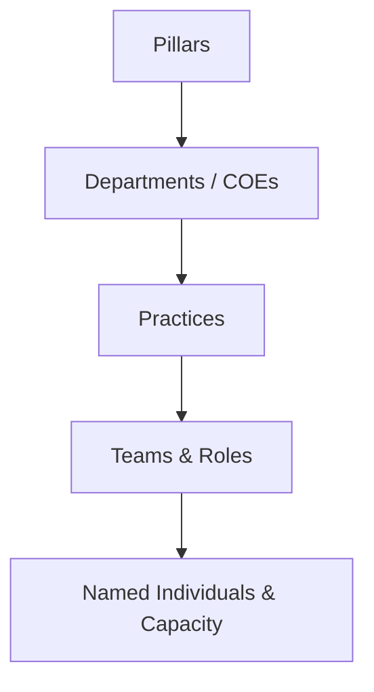
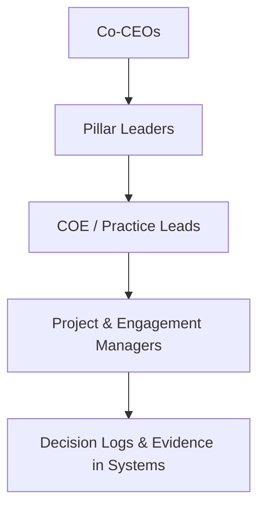
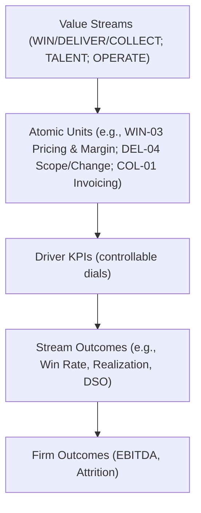
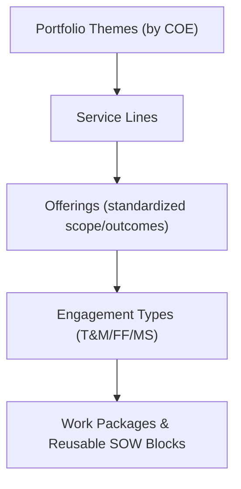
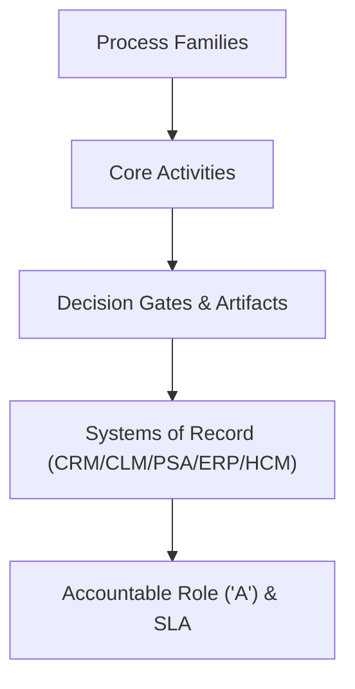
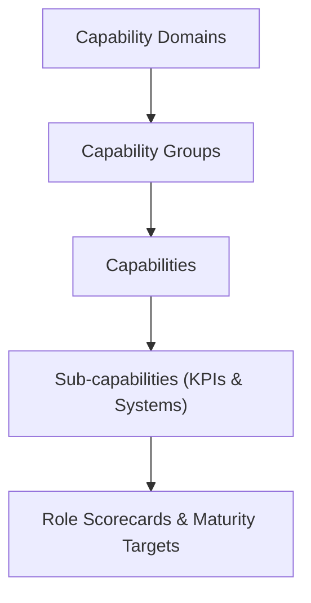
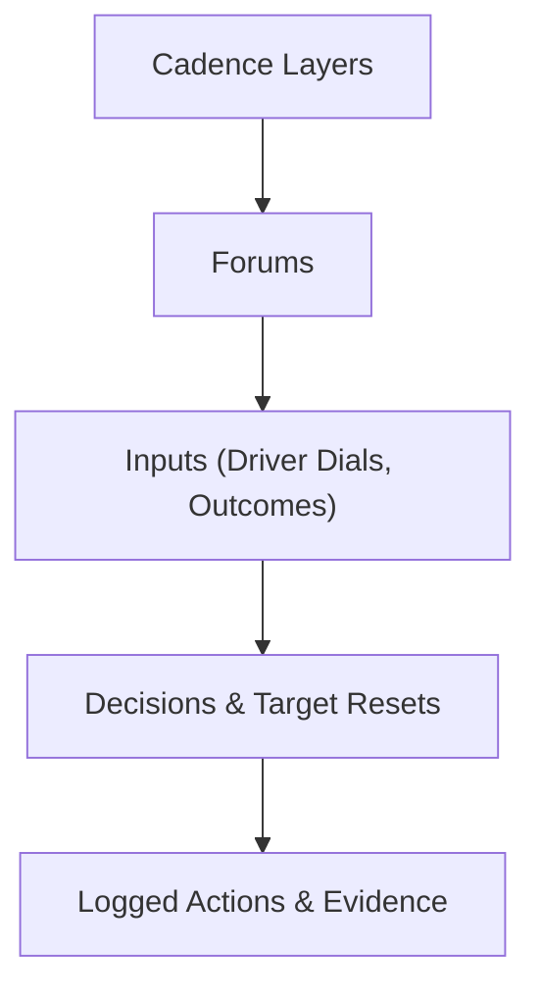

### Checklist

- Map Elire’s **known hierarchies** (pillars → COEs/practices → teams) to establish the baseline. 
- Introduce **new professional‑services hierarchies** (value streams, capability model, client service lines, process framework, governance cadence) in plain terms. 
- **Bridge** from today’s model to the new ones using the Value‑Stream + Atomic Unit logic already drafted in Analysis.md. 
- **Visualize** each hierarchy with a mermaid diagram (4+ levels) to show roll‑ups and decision ownership.
- Define **value streams in Elire language**, show sources, and slot them into current processes. 
- Provide **framework integration analysis** (complements, conflicts, gaps, overlaps, ambiguities) with explicit callouts. 
- **Validate completeness** against your request and self‑correct where needed.

------

## Hierarchies

### 1) **Elire Organizational Hierarchy (Existing)**: Purpose and role in Elire, expanded with new framework ideas.

**Purpose & scope (today):** This is how budgets, headcount, and accountability formally roll up: **Pillars → Departments/COEs → Practices → People**. It’s the view partners use to staff and account for the business. 
**Expansion (new idea):** Keep this for **people/budget** control; pair it with value‑stream dials for **work** control. 

- **Level 1:** Pillars (Leadership; Client Relationships; Service Execution; Talent; Finance & Operations). 
- **Level 2:** Departments/COEs (e.g., Sales/Marketing/Proposals under Client Relationships; MAS, Cloud Enterprise, Solution Center, On‑Prem, EPM & Analytics, Treasury under Service Execution). 
- **Level 3:** Practices (e.g., Cloud HCM/ERP/Tech; PMO/SAS; Planning & Analytics; Close & Consolidations; Kyriba SaaS Treasury; PeopleSoft Treasury). 
- **Level 4+:** Teams/roles/individual leaders (e.g., Delivery Leader; practice leads John/Jason/Arjun; Proposal Manager; HR Director; Accounting Director). 

**Point:** Organizes people, budgets, and official accountability by practice. **Limit today:** it doesn’t define the *work units*where one owner has a lever and proof lives in a system. 
**Connections:** Becomes the **people/budget spine** that supports the **Value‑Stream spine** (below). 



------

### 2) **Governance & Decision Rights (Existing)**

**Purpose & scope:** Who sets strategy and who enforces operating standards: **Co‑CEOs → Pillar leaders → COE/Practice Leads → Project/Engagement Managers**. 
**Expansion:** Tie each forum/role to the **driver dials** and **evidence systems** (CRM/PSA/ERP/HCM/CLM). 

- **Level 1:** Co‑CEOs (strategy, growth, financial performance). 
- **Level 2:** Pillar heads (Sales/Marketing/Proposals; Delivery; Talent; Finance & Ops). 
- **Level 3:** COE/Practice leaders (e.g., Cloud Enterprise, EPM, Treasury, On‑Prem, MAS, Solution Center). 
- **Level 4+:** PMs/EMs and functional managers (decision execution and proof capture). 

**Point:** Ensures decisions and standards cascade; today it measures many *outcomes* but not the *controllable drivers*. 
**Connections:** This hierarchy **owns** the outcomes scoreboards of the value streams and enforces one “A” per atomic unit. 



------

### 3) **Value‑Stream & KPI Rollup (New)**

**Purpose & scope:** Operate the work through **WIN → DELIVER → COLLECT** (customer streams) with enablers **TALENT** and **OPERATE**; manage at **Atomic Units** with controllable dials that roll up to outcomes. 
**Plain terms for partners:** It’s the “how value flows” view: create demand and close (WIN), execute (DELIVER), turn work to cash (COLLECT), and the two engines that make all of it possible (TALENT, OPERATE). 

- **Level 1:** Streams (WIN, DELIVER, COLLECT; enablers TALENT, OPERATE). 
- **Level 2:** Atomic Units (20 defined units like Lead Qualification, Pricing & Margin, Handoff, Scope/Change, Invoice Generation). 
- **Level 3:** Driver KPIs per unit (e.g., Lead Response Time, Discount Decision Cycle, Handoff Completeness, Scope Capture Ratio, Invoice Error Rate). 
- **Level 4+:** Stream outcomes → Firm outcomes (Win Rate, Avg Sold Margin; Realization, On‑Time, Utilization; DSO → EBITDA/Attrition). 

**Point:** Organizes *work* into controllable dials with clean rollups to firm results—what the org tree can’t do alone. 
**Connections:** Each atomic unit maps to a responsible role in the **Elire org hierarchy** and to a **process** (next hierarchy). 



------

### 4) **Client Service Lines & Offerings (New)**

**Purpose & scope:** Make the “what we sell” explicit and modular: **Portfolio Themes → Service Lines → Offerings → Engagement Types → Work Packages**. This helps reuse content, price consistently, and align to delivery playbooks. 
**Elire mapping:** Themes/Lines align to COEs (Cloud Enterprise, On‑Prem, EPM & Analytics, Treasury, MAS, Solution Center/Managed Services). Offerings codify repeatable work (e.g., Cloud HCM Phase 0, ERP Assessment, Kyriba Implementation). 

- **Level 1:** Portfolio Themes (Cloud Enterprise; On‑Prem; EPM & Analytics; Treasury; MAS; Managed Services). 
- **Level 2:** Service Lines (e.g., HCM, ERP, Tech; Planning & Analytics; Close & Consolidations; Treasury SaaS; PSFT Treasury). 
- **Level 3:** Offerings (named solutions with scope & outcomes). 
- **Level 4+:** Engagement Types (T&M, Fixed‑Fee, Managed Services) → Standard Work Packages & SOW blocks. 

**Point:** Organizes our market‑facing catalog for pricing, proposal reuse, and handoff quality. 
**Connections:** Each Offering links to **process activities** (solutioning, pricing, proposal) and **value‑stream units**(WIN‑02/03/04). 



------

### 5) **Professional‑Services Process Framework (New)**

**Purpose & scope:** Tie day‑to‑day steps to value streams: **Strategy‑to‑Plan; Market‑to‑Lead; Lead‑to‑Opportunity; Opportunity‑to‑Proposal; Proposal‑to‑Close; Demand‑to‑Resource; Deliver‑to‑Value; Change‑to‑Cash**. 

- **Level 1:** Process Families (above). 
- **Level 2:** Core activities (e.g., Go/No‑Go, Solutioning, Deal Reg, Handoff, Change Orders, Rev‑rec). 
- **Level 3:** Artifacts & decision gates (proposal content library, pricing guardrails, handoff checklist, change‑order log). 
- **Level 4+:** Systems of record (CRM/CLM/PSA/ERP/HCM) and role “A” (Accountable owner). 

**Point:** Organizes *how* work happens so dials can be instrumented and audited. 
**Connections:** Each activity plugs into a **Value‑Stream atomic unit** and is executed by a role in the **Elire org**. 



------

### 6) **Capability Model (New)**

**Purpose & scope:** Name the *abilities* we must be excellent at to scale: **Sell; Deliver; Collect; Enable Talent; Run Operations**; decompose to sub‑capabilities and owners. 

- **Level 1:** Domains (Sell, Deliver, Collect, Talent, Operate). 
- **Level 2:** Capability groups (e.g., Demand Gen, Qualification, Pricing; Resourcing, PM, QA; Invoicing, Collections; Recruiting, Onboarding, Development, Retention; Planning/Forecasting, Performance Mgmt, Risk & Compliance). 
- **Level 3:** Capabilities (e.g., Lead Scoring; Handoff; Scope/Change; Rev‑rec). 
- **Level 4+:** Sub‑capabilities with primary “A”, KPIs, and systems. 

**Point:** Organizes *what we must be good at*—the stable backbone for role scorecards and maturity growth. 
**Connections:** Capabilities are realized by **processes**, measured as **atomic unit dials**, and staffed through the **org hierarchy**. 



------

### 7) **Operating Cadence & Performance Management (New)**

**Purpose & scope:** The rhythm that turns data into decisions: **Weekly operators (driver dials)** → **Monthly board (stream/firm outcomes)**. 

- **Level 1:** Cadence layers (weekly, monthly, quarterly). 
- **Level 2:** Forums (operators vs board/QBR). 
- **Level 3:** Inputs (driver dial snapshots; outcomes scoreboards; misattribution log). 
- **Level 4+:** Outputs (decisions, target resets, actions, audit trail in systems). 

**Point:** Organizes the **who/when** of decisions so drivers are managed weekly and outcomes judged monthly. 
**Connections:** Enforced by **Governance hierarchy**; consumes data from **Process + Value‑Stream** hierarchies. 



------

## Value Streams

> **Plain Elire language** with source attribution and placement.

### WIN — Create and convert demand

**Related processes:** Market‑to‑Lead; Lead‑to‑Opportunity; Opportunity‑to‑Proposal; Proposal‑to‑Close. 
**Organizational placement:** Client Relationships pillar (Sales, Marketing, Proposals/Contracts) with Delivery SMEs for solutioning. 
**Source:** Framework (process families) + Analysis.md (atomic units & dials). 
**Connection to Elire:** Adds guardrails (lead scoring, Go/No‑Go, pricing/margin decision rights) and evidence standards in CRM/CLM; reduces “Delivery absorbs the compromise” pattern. 

### DELIVER — Execute client work predictably

**Related processes:** Demand‑to‑Resource; Deliver‑to‑Value. 
**Organizational placement:** Service Execution pillar (COEs, practices, PMO/SAS). 
**Source:** Framework + Analysis.md units (handoff, staffing, milestones, scope/change, closure). 
**Connection to Elire:** Formal handoff gate; resourcing SLA; scope capture discipline; PMs own weekly dials in PSA. 

### COLLECT — Turn work into cash

**Related processes:** Change‑to‑Cash. 
**Organizational placement:** Finance & Operations (Accounting/Finance). 
**Source:** Framework (invoicing, collections, rev‑rec) + Analysis.md unit mapping. 
**Connection to Elire:** Billing proof standards; error codes; proactive collections; DSO as stream outcome tied back to staffing/timeline choices. 

### TALENT — Get and keep the right people (enabler)

**Related processes:** Recruiting, Onboarding, Development, Retention. 
**Organizational placement:** Talent pillar (HR/Recruiting) with practice lead inputs. 
**Source:** Analysis.md (TAL‑01..04 atomic units) aligned to framework’s capability pillar. 
**Connection to Elire:** Tracks *Time‑to‑Fill, Time‑to‑First‑Bill, Certifications per FTE*; feeds **Utilization** and **Attrition**outcomes. 

### OPERATE — Plan, steer, stay compliant (enabler)

**Related processes:** Strategy‑to‑Plan; Performance Management; Risk & Compliance. 
**Organizational placement:** Leadership + Finance & Ops (planning/forecasting); Delivery leader for operating rhythm. 
**Source:** Analysis.md (OPS‑01..03) + framework governance. 
**Connection to Elire:** 90‑day rolling plan across CRM/PSA/ERP/HCM; weekly driver reviews; monthly outcomes; audit‑ready logs. 

*(Optional)* **EXPAND** — Grow existing accounts alongside WIN for land‑and‑expand motion. 

------

## Framework Analysis

### Integration (how the framework complements Elire)

- **Keeps the org tree for budgets/people** and **adds a work spine** (streams → units → dials → outcomes) so owners and levers are unambiguous. This addresses today’s gap where work and evidence are scattered, and Delivery absorbs pricing/scope compromises. 
- **Standardizes processes and gates** (lead scoring, Go/No‑Go, handoff, change orders, invoice/collections cadence) consistent with investor‑grade PSO benchmarks. 
- **Connects systems of record** (CRM/CLM/PSA/ERP/HCM) to decisions and KPIs, enabling weekly control and monthly judgment. 

### Gaps (what’s missing today)

- **No common rollup** from team-level drivers to firm outcomes; each pillar reports its own scoreboard. The value‑stream rollup fixes this. 
- **Pricing & scope decision rights** are porous; need explicit guardrails and “A” owners tied to evidence in CRM/CLM/PSA. 
- **Partner/offering catalog** not formalized into reusable Offerings/Work Packages; this slows proposals and increases variance. 

### Overlaps (where structures touch)

- **Service Lines vs COEs:** COEs house capability and delivery leadership; Service Lines/Offerings define marketable solutions. Map 1:1 where possible; allow some Offerings to span COEs (e.g., Cloud + MAS advisory). 
- **Process framework vs atomic units:** Processes name sequences; atomic units name **decision points** with dials. Keep both: processes for flow, units for control. 

### Conflicts (what to resolve)

- **Pillar KPI focus** (many lagging/survey measures) conflicts with **driver-first** operating control. Shift weekly forums to drivers; judge leaders monthly on outcomes. 
- **Sales‑Delivery boundary**: mid‑flight scope changes bypass change control. Enforce unit ownership (DEL‑04) and reset incentives accordingly. 

------

## Ambiguities (and the assumptions required)

- **Offerings taxonomy depth:** We lack a definitive list of Offerings per Service Line with standard Work Packages. *Assumption:* start from top 10 revenue drivers per COE and codify 2–3 engagement types each. 
- **Observed vs expected “A” owners:** Analysis.md calls for mapping “misattribution deltas,” but Elire’s current observed owners per unit are not inventoried. *Assumption:* run a 0–30 day discovery to capture “observed A” for all 20 units. 
- **Systems instrumentation:** We know target systems (CRM/PSA/ERP/HCM/CLM) but not current field definitions or automation. *Assumption:* adopt minimal common fields per unit to make evidence audit‑ready. 
- **Partner program mechanics (deal registration, tiers):** Direction is clear; specifics are TBD. *Assumption:*segment Referral/VAR/SI and implement PRM or CRM partner portal. 

------

- ### Checklist (what I’m about to do)

  - **Slow down and narrate the logic**—what I read in each file, what I inferred, and why I proposed changes.
  - **Show each logical leap explicitly** as “Because → Therefore → So we add ___,” with concrete examples.
  - **Translate new terms** (value streams, atomic units, process families) into Elire’s current org language.
  - **Walk two end‑to‑end scenarios** so you can *see* the model working.
  - **Call out assumptions vs facts** so you know what’s grounded vs what I proposed.

  ------

  ## 1) What I read (facts) vs. what I concluded (leaps)

  ### A. The baseline you already run on (facts I used)

  - **How Elire is structured today.** You manage the business through an **org tree**: Pillars → COEs/Departments → Practices → People. Budget, headcount, accountability roll up this way. This is how staffing and P&L are actually controlled day‑to‑day. 
  - **What’s inside the pillars.** *Client Relationships* (Sales, Marketing, Proposals/Contracts), *Service Execution*(MAS/PMO/SAS; Cloud Enterprise—HCM/ERP/Tech; Solution Center—Managed Services; On‑Prem—PeopleSoft; EPM; Treasury), plus *Talent* (HR/Recruiting) and *Finance & Ops* (Accounting, IT). 

  > **Why this matters:** It tells me *where people and budgets live*, but not *where controllable work decisions live*. That distinction drives every leap below.

  ### B. The problems your own narrative highlights (facts I used)

  - You describe three repeating breakdowns:
    **(1)** Pricing decisions boomerang into Delivery; **(2)** scope changes happen mid‑flight without capture; **(3)** reactive hiring causes late staffing and burnout. In each story, work decisions and evidence live in different places than the org/accountability owners. 
  - You also say your **KPIs are rollups by pillar**, often lagging or survey‑based, and **don’t give weekly control** to the people who could move outcomes. 

  > **Why this matters:** It tells me the *org tree is necessary for budget and people*, but it’s **insufficient to run the work**. That’s Leap #1.

  ### C. The standard professional‑services value chain (facts I used)

  - Industry frameworks boil the work into **end‑to‑end processes** (e.g., Strategy‑to‑Plan; Market‑to‑Lead; Lead‑to‑Opportunity; Opportunity‑to‑Proposal; Proposal‑to‑Close; Demand‑to‑Resource; Deliver‑to‑Value; Change‑to‑Cash). They also emphasize **cadence/governance** and **capabilities** (Sell, Deliver, Collect, Talent, Operate). 

  > **Why this matters:** It gives us a *neutral, external backbone* to organize work flows—separate from your org tree.

  ------

  ## 2) The exact logic chain I followed (each “leap” spelled out)

  I’m going to make each step painfully explicit:

  ### **Step 1 — Observation → Conclusion (Leap #1):**

  - **Because:** Your **org tree** cleanly rolls up people and budgets, **but not work decisions and proof** (pricing, scope, staffing, billing). 
  - **Therefore:** Keep the org tree for **people/budget control**, but add a **second spine for work control** that names where decisions happen and where evidence lives. 
  - **So we add:** A **value‑stream spine**: **WIN → DELIVER → COLLECT**, with enablers **TALENT** and **OPERATE**. This is the industry‑standard flow adapted to your context. 

  ### **Step 2 — We need smaller “handles” to manage weekly (Leap #2):**

  - **Because:** A stream is too big to control; *weekly control* requires **small, named decision points** with one accountable owner and data in a system. Your doc calls these **“atomic units.”**
  - **Therefore:** Define ~20 **atomic units** (e.g., *WIN‑03 Pricing & Margin*, *DEL‑04 Scope/Change*, *TAL‑01 Recruiting*, *COL‑01 Invoicing*) where exactly **one “A”** owns a **driver KPI** and proof sits in CRM/PSA/ERP/HCM/CLM. 
  - **So we add:** A catalog of units (with **what it is, the decision, the evidence, the driver dial, the “A” boundary**) to be managed weekly. 

  ### **Step 3 — Drivers must roll up to outcomes (Leap #3):**

  - **Because:** Leaders should be judged on **outcomes** (e.g., Win Rate, Realization, On‑Time, Utilization, DSO, EBITDA), but teams must **operate** the **drivers** they can actually move this week. 
  - **Therefore:** Create a **clean rollup**: *Unit driver* → *Stream outcome* → *Firm outcome*. Examples:
    *Discount Decision Cycle → Win Rate/Avg Sold Margin → EBITDA*;
    *Scope Capture Ratio → Realization/On‑Time → EBITDA*;
    *Time‑to‑Fill → Utilization → Attrition/EBITDA*. 
  - **So we add:** A **two‑tier scoreboard**: **weekly driver dials** at the unit level; **monthly outcomes** at stream/firm. 

  ### **Step 4 — We must connect this to industry processes (Leap #4):**

  - **Because:** People *work in processes*, not in abstract “units.” The pro‑services framework lists the **process families**end‑to‑end. 
  - **Therefore:** Map each **atomic unit ↔ specific process steps** (e.g., *Lead‑to‑Opportunity* hosts *WIN‑01 Qualification*; *Demand‑to‑Resource* hosts *DEL‑02 Resourcing*; *Change‑to‑Cash* hosts *COL‑01 Invoicing*). 
  - **So we add:** A **process framework** that *strings the units together* in the order people already experience the work. 

  ### **Step 5 — We must connect this to what we sell (Leap #5):**

  - **Because:** The things we propose and deliver vary by **service line/offerings**, and reusable content makes proposal quality faster and more consistent. 
  - **Therefore:** Introduce **Client Service Lines → Offerings → Work Packages** that align to your **COEs/practices** so Proposals, Handoffs, and Change Orders reuse the same blocks. 
  - **So we add:** A **portfolio hierarchy** tied to **WIN** units (*Discovery, Pricing, Proposal*) and **DELIVER** units (*Handoff, Scope/Change*)—so selling and delivery use the same language. 

  ### **Step 6 — We need a rhythm that enforces this (Leap #6):**

  - **Because:** Without a **cadence**, dials drift and rollups decay into slides. Your analysis proposes a **weekly operator**and **monthly board** rhythm with decision logs. 
  - **Therefore:** **Weekly**: manage unit drivers (pricing cycle, scope capture, time‑to‑fill). **Monthly**: judge stream outcomes (Win Rate, Realization, DSO) and firm outcomes (EBITDA/Attrition). 
  - **So we add:** A **governance cadence** with **one “A” per unit**, **evidence in systems**, and **target resets** based on mix/seasonality. 

  ------

  ## 3) Translating the new terms into Elire’s language (no jargon)

  - **Value Stream (WIN / DELIVER / COLLECT; TALENT; OPERATE)** = *A lane of work that turns demand into cash, plus the engines that enable it.* This *sits next to* (not replaces) your org tree. 
  - **Atomic Unit** = *The smallest decision point where exactly one person is accountable, with a controllable driver and proof in a system.* Example: *WIN‑03 Pricing & Margin Decision.*
  - **Process Family** (e.g., *Lead‑to‑Opportunity*) = *The path people already follow day‑to‑day.* Units plug into these steps. 
  - **Service Line / Offering** = *A catalog of what we sell,* aligned to your COEs/practices (Cloud HCM/ERP/Tech, PeopleSoft, EPM, Treasury, MAS, Managed Services). 

  ------

  ## 4) “Show me, don’t tell me” — two end‑to‑end scenarios

  ### Scenario 1 — *“Can we discount 10%?”* (the classic)

  **Today (what happens):** Sales asks Delivery; Delivery considers scope/risk/staffing; evidence lives in email or a deck; deal closes; later **realization suffers**. 

  **With the model:**

  1. **Unit:** *WIN‑03 Pricing & Margin Decision.*
     **A:** Sales leader (unless decision rights push to Delivery under guardrails).
     **Driver:** *Discount Decision Cycle* (hours). **Evidence:** CRM/CLM decision log. 
  2. **Guardrails:** Tied to the **Offering** selected and **Work Packages** included (scope is explicit). 
  3. **Handoff Gate:** *DEL‑01 Handoff Completeness* rejects deals missing an approved pricing decision log. 
  4. **Rollup:** Faster, well‑evidenced pricing decisions improve **Win Rate / Avg Sold Margin (WIN outcomes)** and protect **Realization (DELIVER outcome)** → **EBITDA (firm)**. 

  **The leap you asked about:** We moved from a *people conversation* (Sales ↔ Delivery) to an *operating unit with a dial and evidence*, so weekly we can see “where pricing gets stuck” and who owns it.

  ------

  ### Scenario 2 — *“Scope changed mid‑flight; we’ll just handle it.”*

  **Today:** Scope gets renegotiated in the project hallway; **change isn’t captured**; margin leaks; Delivery later explains it as “relationship maintenance.” 

  **With the model:**

  1. **Unit:** *DEL‑04 Scope/Change Management.*
     **A:** Project/Delivery Manager. **Driver:** *Scope Capture Ratio* (billed delta / identified delta). **Evidence:** PSA change order log + CLM. 
  2. **Process tie‑in:** This sits inside **Deliver‑to‑Value**; the **Offering** and **SOW blocks** make “in/out” **auditable**. 
  3. **Rollup:** Better capture → higher **Realization/On‑Time (DELIVER outcomes)** → stronger **EBITDA**. 

  **The leap you asked about:** By naming *Scope/Change* as its own **unit** with a clear “A” and a measurable **driver**, we stop arguing anecdotes and start managing a **ratio** every week.

  ------

  ## 5) How each pillar changes (what you keep vs what you operate vs how you’re judged)

  - **Client Relationships → WIN**
    *Keep (context):* Pipeline, RFP win%.
    *Operate (weekly drivers):* Response time, qualification completeness, discount cycle, proposal reuse.
    *Judge (monthly outcomes):* **Win Rate, Avg Sold Margin**. 
  - **Service Execution → DELIVER**
    *Keep:* CSAT.
    *Operate:* Handoff completeness, time‑to‑staff, scope capture, on‑time milestones.
    *Judge:* **Realization, On‑Time, Utilization**. 
  - **Finance & Ops → COLLECT + OPERATE**
    *Operate:* Invoice error rate; 90‑day plan accuracy.
    *Judge:* **DSO (COLLECT), EBITDA (firm)**. 
  - **Talent → TALENT**
    *Operate:* Time‑to‑fill; onboarding handoff; certifications per FTE.
    *Judge:* **Utilization (stream), Attrition (firm)**. 

  ------

  ## 6) Where the **Professional Services** framework fits (and doesn’t)

  - **Fits:** It gives us the **process families** to hang the units on (e.g., *Lead‑to‑Opportunity*; *Demand‑to‑Resource*; *Deliver‑to‑Value*; *Change‑to‑Cash*), plus the idea of **governance cadence** and **capabilities** (Sell, Deliver, Collect, Talent, Operate). 
  - **Doesn’t by itself:** It doesn’t tell you the **atomic unit level** or the weekly **driver dials**—that’s what your **Analysis.md** supplies. 
  - **So the bridge is:** *Processes = flow*, *Atomic Units = control points*, *Outcomes = judgment*. We need all three. 

  ------

  ## 7) What was **assumption** vs **established** (so you know where I filled gaps)

  - **Established (from your files):**
    Org tree and leaders; pillar KPIs; the 3 repeating breakdowns; the value‑stream concept (3+2); the full **20 atomic units** with owners/evidence/dials; the weekly/monthly cadence. 
    The industry process families and governance/capability framing. 
  - **Assumptions I added (called out previously):**
    A catalog structure for **Service Lines → Offerings → Work Packages** mapped to your COEs (to make proposals/handoffs reusable). 
    A minimal set of **guardrails** (e.g., pricing approval path tied to offering; handoff completeness criteria). These are consistent with the framework but require your choice of thresholds. 

  ------

  ## 8) One‑page mental model (print this if nothing else)

  ```
  Org Tree (people/budgets/accountability)             ← keep for staffing & P&L
           │
           ├── supports
           ▼
  Value Streams (WIN, DELIVER, COLLECT; TALENT, OPERATE)   ← how value flows
           │
           ├── decomposed into
           ▼
  Atomic Units (20)                                        ← where ONE “A” owns a driver & evidence
    e.g., Pricing, Handoff, Staffing, Scope/Change, Invoicing, Recruiting
           │
           ├── measured weekly as
           ▼
  Driver Dials (controllable)                              ← response time, scope capture ratio, etc.
           │
           ├── roll up monthly to
           ▼
  Stream Outcomes (Win Rate, Realization, DSO, etc.)       ← judge leaders by outcomes
           │
           └── contribute to
  Firm Outcomes (EBITDA, Attrition)
  ```

  

  ------

  ## 9) Why this isn’t “consulting theater” (how you’ll *feel* it next week)

  - **Sales** will have a **pricing decision log** in CRM/CLM; if it’s missing, Delivery can **refuse handoff** (gate). **Weekly**, you’ll see *Discount Decision Cycle* trend by offering. 
  - **PMs** will show **Scope Capture Ratio** from the PSA change‑order log—no more anecdotes. **Monthly**, Delivery is judged on **Realization / On‑Time**, not slide colors. 
  - **Talent** will publish **Time‑to‑Fill** and **Time‑to‑First‑Bill** by skill, feeding **Utilization**. Hiring becomes proactive from pipeline signals. 
  - **Finance/Ops** will show **Invoice Error Rate** and **DSO** with clear escalation cadences, reducing cash friction. 

  ------

  ## 10) Sanity check (did I answer your “bring me along” ask?)

  - I **separated facts from leaps** and showed each *Because → Therefore → So we add* step.
  - I **translated** the terms into Elire language and **mapped** them to your org/processes.
  - I **walked scenarios** so you can *see* the model working.
  - I **flagged assumptions** vs **established** content with sources.

  If you want me to keep going, I can take **one** scenario you care most about (e.g., Cloud HCM deals under $500k) and **show the exact fields, owners, and dials** we’d instrument in CRM/PSA/ERP/HCM to make the unit‑to‑outcome rollup work—using your current systems and roles as they are. 

