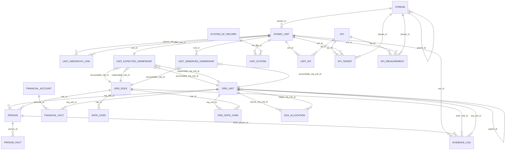

# Elire Operations Database Design Document

## Executive Summary

The `elire_ops_1` database implements a "Rosetta Stone" architecture that connects organizational value streams, ownership structures, KPIs, and financial data through atomic work units. This design enables multi-dimensional analysis of work attribution, performance metrics, and financial outcomes across the organization.

## Core Architecture Concept

The database uses **Atomic Units** as the fundamental join points that connect:
- **Value Streams** (WIN, DELIVER, COLLECT, TALENT, OPERATE)
- **Organizational Hierarchy** (Pillars → Departments/COEs → Practices → People)
- **Ownership Model** (Expected vs Observed)
- **KPIs** (Leading drivers and Lagging outcomes)
- **Systems of Record** (CRM, PSA, FIN, HCM, DOC)
- **Financial Data** (Revenue, Costs, Margins)

## Entity Relationship Diagram



## Database Schema Overview

### Core Tables (21 Total)

#### 1. Core Dimensions (5 tables)
- **stream** - Value stream hierarchy
- **atomic_unit** - Fundamental work units
- **org_unit** - Organizational hierarchy
- **org_role** - Role definitions
- **person** - Individual employees

#### 2. Ownership Management (3 tables)
- **unit_expected_ownership** - Design-based ownership
- **unit_observed_ownership** - Actual ownership (append-only)
- **unit_hierarchy_link** - Parent-child unit relationships

#### 3. Systems & Evidence (3 tables)
- **system_of_record** - System definitions (CRM, PSA, etc.)
- **unit_system** - Unit-to-system mappings
- **evidence_log** - Immutable audit trail

#### 4. KPI Management (4 tables)
- **kpi** - KPI definitions with types
- **unit_kpi** - Unit-to-KPI mappings
- **kpi_target** - Target values and thresholds
- **kpi_measurement** - Actual measurements

#### 5. Financial Management (6 tables)
- **financial_account** - Chart of accounts
- **financial_fact** - Budget and actual amounts
- **rate_card** - Standard role rates
- **org_rate_card** - Practice-specific rates
- **person_fact** - Individual hours and rates
- **sga_allocation** - SG&A distribution rules

### Custom Types (2)
- **kpi_kind** - ENUM ('leading', 'lagging')
- **kpi_scope** - ENUM ('unit', 'stream', 'firm')

## Key Views (21 Total)

### Core Rosetta Views
1. **v_rosetta_stone** - Basic pivot view joining units to all dimensions
2. **v_rosetta_stone_enhanced** - Extended version with additional metrics
3. **v_rosetta_truth** - Expected vs observed ownership comparison

### Hierarchical Tree Views
4. **v_org_tree** - Organizational hierarchy with financials
5. **v_org_tree_with_ownership** - Org tree with ownership alignment stats
6. **v_stream_tree** - Value stream hierarchy
7. **v_stream_tree_with_ownership** - Stream tree with unit ownership details

### Rollup & Aggregation Views
8. **v_org_rollup** - Organization metrics aggregation
9. **v_stream_rollup** - Stream-level KPI aggregation
10. **v_financial_rollup** - Direct P&L by org unit
11. **v_financial_rollup_with_sga** - P&L with allocated SG&A
12. **v_kpi_rollup** - KPI driver-to-outcome mapping

### Operational Views
13. **v_misattribution_delta** - Identifies ownership mismatches
14. **v_inferred_observed_90d** - Infers ownership from evidence
15. **v_observed_from_evidence** - Evidence log for UI display
16. **v_ownership_summary** - Ownership status summary
17. **v_update_validation** - Data integrity checks

### UI Helper Views
18. **v_org_options** - Organization dropdown options
19. **v_role_options** - Role dropdown options
20. **v_stream_options** - Stream dropdown options
21. **v_stream_units_with_ownership** - Units with ownership for stream page
22. **v_ui_validation** - UI-specific validation checks

## Data Flow Architecture

### 1. Hierarchical Structure
```
Value Streams                    Organization
     |                               |
  [Streams]                      [Pillars]
     |                               |
[Sub-streams]                [Departments/COEs]
     |                               |
[Atomic Units] <---------->     [Practices]
     |                               |
[Evidence/KPIs]                  [People]
```

### 2. Ownership Model
- **Expected Ownership**: Pre-seeded based on organizational design
- **Observed Ownership**: Captured through UI to expose misattribution
- **Evidence Trail**: Immutable log of all ownership changes

### 3. Financial Flow
```
Financial Accounts → Financial Facts → Org Units → Rollup Views
                          ↓
                    Person Facts → Rate Cards → Margin Calculations
                          ↓
                    SG&A Allocation → Adjusted P&L
```

### 4. KPI Architecture
- **Leading KPIs**: Unit-level controllable drivers
- **Lagging KPIs**: Stream/firm-level outcomes
- **Measurements**: Time-series data with source tracking
- **Targets**: Thresholds for performance management

## Key Design Principles

### 1. Append-Only History
- Never update observed ownership rows - always INSERT new ones
- Views automatically select the most recent observation
- Evidence log provides complete audit trail

### 2. Natural Key Idempotency
- Use ON CONFLICT DO NOTHING for safe data refreshes
- Unique constraints prevent duplicate entries
- Natural keys follow consistent patterns

### 3. View-Based Logic
- All rollups calculated in SQL views, not application code
- Hierarchical relationships defined in database
- API endpoints are simple passthroughs to views

### 4. Data Integrity Rules
- Unit codes: `STREAM-##` format (e.g., WIN-01)
- Org codes: Underscores (e.g., PILLAR_SERVICE_EXEC)
- Role codes: Underscores (e.g., DELIVERY_LEAD)
- Evidence types: Enumerated values
- System refs: CRM, PSA, FIN, HCM, DOC, UI

## Current Implementation Status

### Populated Data
- ✅ Complete organizational hierarchy with named leaders
- ✅ All 20 core atomic units plus 9 SELL sub-units
- ✅ Expected ownership assignments
- ✅ 2025 budget data loaded
- ✅ KPI definitions and targets
- ✅ System-to-unit mappings

### Awaiting Population
- ⏳ Observed ownership (via UI entry)
- ⏳ Actual financial data (2025 actuals)
- ⏳ KPI measurements
- ⏳ Evidence log entries
- ⏳ PSA actual hours

## Performance Considerations

### Indexes
- Primary keys on all tables
- Foreign key indexes for joins
- Composite indexes on frequently queried columns
- Time-based indexes on evidence and measurement tables

### View Optimization
- Recursive CTEs for hierarchical rollups
- Materialized aggregates where appropriate
- Latest-record patterns using DISTINCT ON
- Efficient window functions for rankings

## Security & Compliance

### Audit Features
- Immutable evidence_log table
- Timestamp tracking on all changes
- Actor identification (person, role, org)
- Source system references

### Data Governance
- Clear ownership model (expected vs observed)
- Role-based access patterns
- Separation of budget vs actual data
- Protected financial allocations

## Migration & Evolution Strategy

### Schema Versioning
- Numbered SQL files for sequential execution
- Idempotent operations where possible
- Clear separation of schema, seed, and updates

### Future Enhancements
- Additional KPI types and calculations
- Extended evidence categorization
- Real-time data integration hooks
- Advanced analytical views

## Directory Structure

The database files are organized in a clean, logical structure:

```
elire_ops_1/
├── 01-schema/          # Core database schema definitions
├── 02-seed/            # Initial seed data
├── 03-views/           # Database views
├── 04-migrations/      # Schema updates and migrations
├── 05-procedures/      # Stored procedures (future)
├── 06-sample-data/     # Test and demo data
├── docs/               # Documentation
├── scripts/            # Management scripts
└── README.md           # Quick start guide
```

## Related Documentation
- `table-reference.md` - Detailed table specifications
- `cleanup-recommendations.md` - Directory organization plan
- `DesignDecisions.md` - Original design rationale
- `migration-log.md` - Record of structural changes
- `../CLAUDE.md` - Implementation guidelines